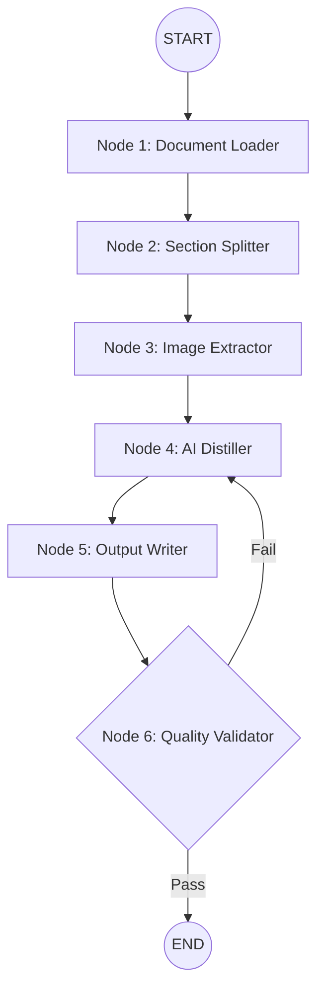

# System Architecture — LangGraph Pipeline

The Knowledge Distiller is built on **LangGraph**, treating each stage of the distillation process as a discrete node in a stateful graph.

## Graph Flow

## State Management (`PipelineState`)

The graph maintains a central state object that is passed and updated between nodes:

| Key | Type | Description |
|---|---|---|
| `file_path` | `str` | Path to the source document |
| `document` | `DocumentState` | Raw text and metadata after loading |
| `sections` | `List[Section]` | List of split sections with page ranges |
| `current_section_index` | `int` | Index of the section being processed |
| `distilled_sections` | `List[DistilledSection]` | Results from the AI distillation |
| `output_file_path` | `str` | Path to the generated Markdown file |

## Key Benefits of LangGraph
1. **Checkpointing**: The pipeline can be resumed from any node if it fails.
2. **Cycle Support**: The Validator node can send a section back to the Distiller if the quality is insufficient.
3. **Observability**: Each step's input and output can be logged for debugging.
